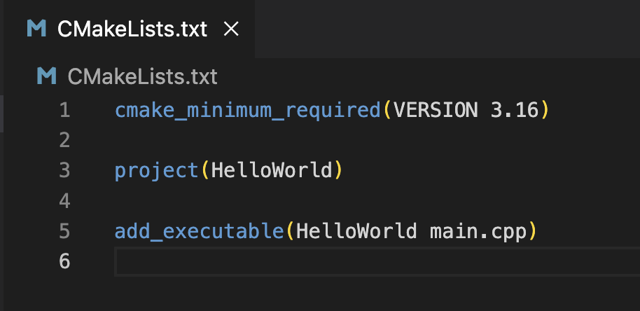
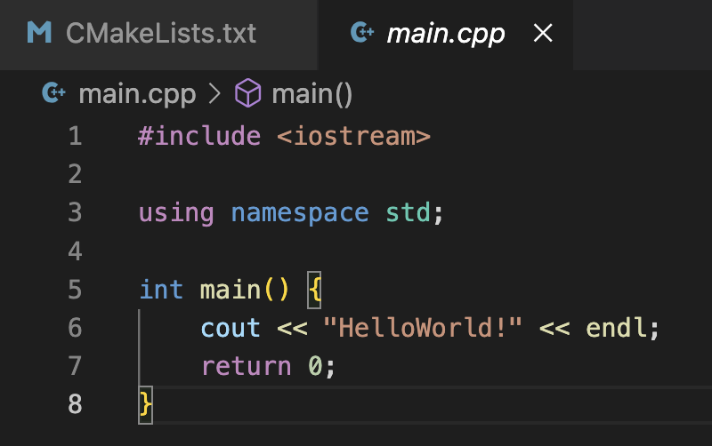

所谓**universal binary**，就是能够同时支持*arm*和*x86*指令集的可执行程序或者动态库。随着**Apple**自己**Apple Silicon**的**CPU**推出，这种格式又重新得到了广泛应用。为什么说”又“呢，因为**Apple**很早以前换**Intel CPU**的时候早就用过了。

说白了，就是把程序编译成*x86*一次，然后再编译成*arm*一次，然后用工具把两个文件合并起来。运行和加载的时候，只要能识别这个格式，根据当前**CPU**类型，提取需要的那段二进制代码运行就行。

常用的工具，就是**lipo**，不过**Apple clang**本来就支持直接编译出**universal binary**，所以使用**lipo**这一步也就省了。

如果是用Xcode进行构建项目，直接有*Architectures*这个构建选项，在里面可以选择*arm*和*intel*。


如果你是用**CMake**进行构建，那就需要一个特殊的**CMake**变量，__CMAKE_OSX_ARCHITECTURES__。

首先让我们新建一个**CMake**的项目。

*CMakeLists.txt*
```
cmake_minimum_required(VERSION 3.16)

project(HelloWorld)

add_executable(HelloWorld main.cpp)
```



*main.cpp*
```
#include <iostream>

using namespace std;

int main() {
    cout << "HelloWorld!" << endl;
    return 0;
}
```



接着我们使用**cmake**构建这个程序，运行一下命令。

```
mkdir build
cd build
cmake ..
cmake --build .
```

运行结果如下：


由于我的**intel**的电脑，所以编译出来的HelloWorld程序只有x86_64的代码。
```
test % file HelloWorld 
HelloWorld: Mach-O 64-bit executable x86_64
```

接着我们运行cmake的时候配置*CMAKE_OSX_ARCHITECTURES*参数。

```
cmake .. "-DCMAKE_OSX_ARCHITECTURES=arm64;x86_64"
```

编译出来的就是universal binary。


