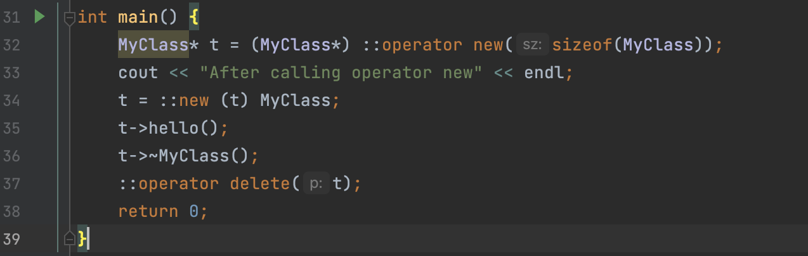

# C++里面的new和delete

*C++*是个相当复杂的语言，单单是**new**和**delete**这两个关键字，还玩出了不少花样。

通常来说**new**和**delete**就是用来完成内存分配和调用构造和析构函数的。

比如：

```
#include <iostream>

using namespace std;

class MyClass {
public:
    explicit MyClass() {
        cout << "MyClass constructor" << endl;
    }

    void hello() {
        cout << "HelloWorld" << endl;
        return;
    }
    virtual ~MyClass() {
        cout << "MyClass destructor" << endl;
    }
};

int main() {
    MyClass* t = new MyClass;
    t->hello();
    delete t;
    return 0;
}
```


运行结果如下：
```
MyClass constructor
HelloWorld
MyClass destructor
```

那有没有办法自己定义分配内存的函数呢？

这里就引入了*operator new*。

*operator new*函数并不负责调用构造子，但是当我们调用*new*的时候，他会自动调用*operator new*分配内存。

```
class MyClass {
public:
    explicit MyClass() {}

    void* operator new(size_t t) {
        cout << "operator new" << endl;
        void* m = std::malloc(t);
        return m;
    }
    void operator delete(void* m) {
        cout << "operator delete" << endl;
        std::free(m);
        return;
    }
    void hello() {
        cout << "HelloWorld" << endl;
        return;
    }
    virtual ~MyClass() {}
};
```


这里我们在类里面重写了*operator new*和*operator delete*。

运行刚才的*main*函数，输出如下：

```
operator new
HelloWorld
operator delete
```

故事还没有完，这两个函数可以单独用来分配内存，能不能单独调用构造子？

这时候就需要使用*new*的完整形式**placement new**。

```
new (<address>) type
```

当**placement new**的第一个参数是指针时，他会自动调用**operator new(size_t, void\*)**，而这个函数的默认实现是不分配地址，返回传入的指针。所以通过这种调用方式，相当于直接调用了构造子。

比如下面的代码：

```
int main() {
    MyClass* t = (MyClass*) ::operator new(sizeof(MyClass));
    cout << "After calling operator new" << endl;
    t = ::new (t) MyClass;
    t->hello();
    t->~MyClass();
    ::operator delete(t);
    return 0;
}
```



这里在直接调用**operator new**之后，使用**placement new**，然后传入一个指针参数，这一步会跳过内存分配，而直接调用**constructor**。末尾也直接调用析构函数，之后再调用**operator delete**释放内存。

运行结果如下：
```
After calling operator new
constructor
HelloWorld
destructor
```

由于C++的一些特殊应用场合，C++额外定义了**operator new/delete**和**placement new**。使得分配内存和调用构造子能够分开。从而可以实现新的内存分配方案。

通常我们是不需要使用这个机制的。

首先在操作系统一层，就会实现一套内存管理机制。

接着在C/C++运行时，也会实现一套内存分配机制。

最后在调用STL的时候，还有一层内存分配机制。

所以如果不是在某些特殊应用场景，很难做出更高效的内存分配机制。
