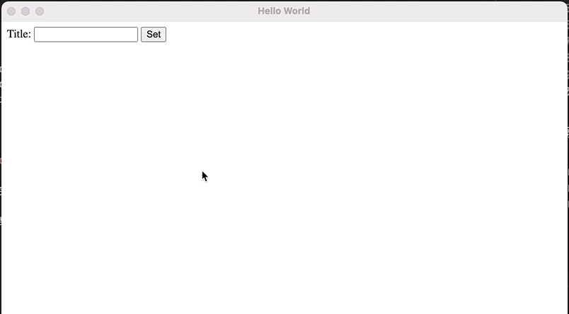

# Electron进程间通信

进程间通信（Inter-Process Communication）对于Electron使相当重要的，由于renderer process没有权限处理系统有关的任务（比如访问文件系统），而对于桌面应用来说，这些又是必须的。所以renderer process需要和main process通信，由main process，或者main process发起新的进程去完成这些任务。

在Electron里面，进程间通信依赖于IPC channels。由`ipcMain`和`ipcRenderer`模块完成通信。

## 模式1: Renderer到Main（单向）

通过在renderer process调用`ipcRenderer.send()`，以及main process调用`ipcMain.on()`注册event listener实现。

首先我们现在main process里面注册一个`set-title`事件的listener，当收到事件之后，将设置窗口的标题。

```
    ipcMain.on('set-title', (event, title) => {
        const webContents = event.sender;
        const win = BrowserWindow.fromWebContents(webContents);
        win?.setTitle(title);
    });
```


接着我们需要在renderer process里面调用`ipcRenderer.send()`，发送时间给main process。由于ipcRenderer需要在*preload.js*里面使用，所以我们需要在*preload.ts*里面定义个API接口给嵌入页面使用。这个`electronAPI`会被放到全局的window对象中。

```
import { contextBridge, ipcRenderer } from 'electron';

contextBridge.exposeInMainWorld('electronAPI', {
    setTitle: (title: string) => ipcRenderer.send('set-title', title)
});
```


接着在*index.html*里面放一个input box和一个button，让用户能够输入需要的标题名。
并且添加`<script>`标签，我们可以把我们需要用的js代码放在*renderer.js*里面。

```
    <body>
        Title: <input id="title" />
        <button id="btn" type="button">Set</button>
        <script src="./renderer.js"></script>
    </body>
```


最后添加*renderer.js*用于调用刚才的`setTitle`API。

```
const titleInput = document.getElementById('title');
const btn = document.getElementById('btn');
btn.addEventListener('click', () => {
    const title = titleInput.value;
    window.electronAPI.setTitle(title);
});
```


这样就完成了renderer process到main process的通信。

运行结果：



## 模式2: renderer process和main process双向通信

其实只要各定义一条通信通道，就能实现双向通信。但是由于这样的场景应用非常多，所以Electron直接定义了`invoke`和`handle`用来方便实现双向的通信。


我们先实现一个fileOpen的handler，用于返回打开文件对话框的结果。

```
async function handleFileOpen() {
    const { canceled, filePaths } = await dialog.showOpenDialog(
        {
            title: "Open a file"
        }
    );
    if (canceled) {
        return;
    } else {
        return filePaths[0];
    }
}

function createWindow() {
...
    ipcMain.handle('open-dialog', handleFileOpen);
...
}
```


接着修改preload.ts，暴露open-dialog API。

```
import { contextBridge, ipcRenderer } from 'electron';

contextBridge.exposeInMainWorld('electronAPI', {
    setTitle: (title: string) => ipcRenderer.send('set-title', title),
    openDialog: () => ipcRenderer.invoke('open-dialog')
});
```


接着html里面添加一个新的button，和一个`<strong>`标记，用来显示结果。

```
        <button id="open" type="button">Open Dialog</button>
        File Path: <strong id="filePath"></strong>
```


最后添加js，调用新的openDialog API。

```
const openBtn = document.getElementById('open');
const outputLabel = document.getElementById('filePath');
openBtn.addEventListener('click', async () => {
    const filename = await window.electronAPI.openDialog();
    outputLabel.innerText = filename;
});
```


运行结果：


## 模式3: main process到renderer process通信

在WebContents对象里面有个send方法，用于把消息发送给renderer process。
通过ipcRenderer的on方法，注册事件处理函数。

我们首先在main process里面添加一个菜单，用于向renderer process发送消息。

```
    const menu = Menu.buildFromTemplate([
        {
            label: app.name,
            submenu: [
                {
                    label: 'Update Message',
                    click: () => win.webContents.send('update-message', 'Hello from main process')
                }
            ]
        }
    ]);

    Menu.setApplicationMenu(menu);
```


接着我们在preload.ts里面定义API。

```
    menuMessage: (callback: (event: any, message: string) => void) => ipcRenderer.on('update-message', callback)
```

这里先不管event是什么类型的，所以先定义成了*any*。


然后我们定义一个`<strong>`标签，用于显示发过来的message。

```
        <strong id="message"></strong>
```


最有修改renderer.js，注册callback函数。

```
const messageLabel = document.getElementById('message');
window.electronAPI.menuMessage((event, message) => {
    messageLabel.innerText = message;
});
```


这样，当点击菜单的时候，就会发送消息到renderer process。并且renderer process会显示消息内容。


## 模式4: renderer到renderer process

renderer process之前没有直接的联系。
所以如果需要renderer process之间通信，就需要使用ipcMain/ipcRenderer，然后用main process作为中转。
还有一个方案，就是通过main process传递*MessagePort*给两个renderer。这样他们可以通过*MessagePort*进行通信。

